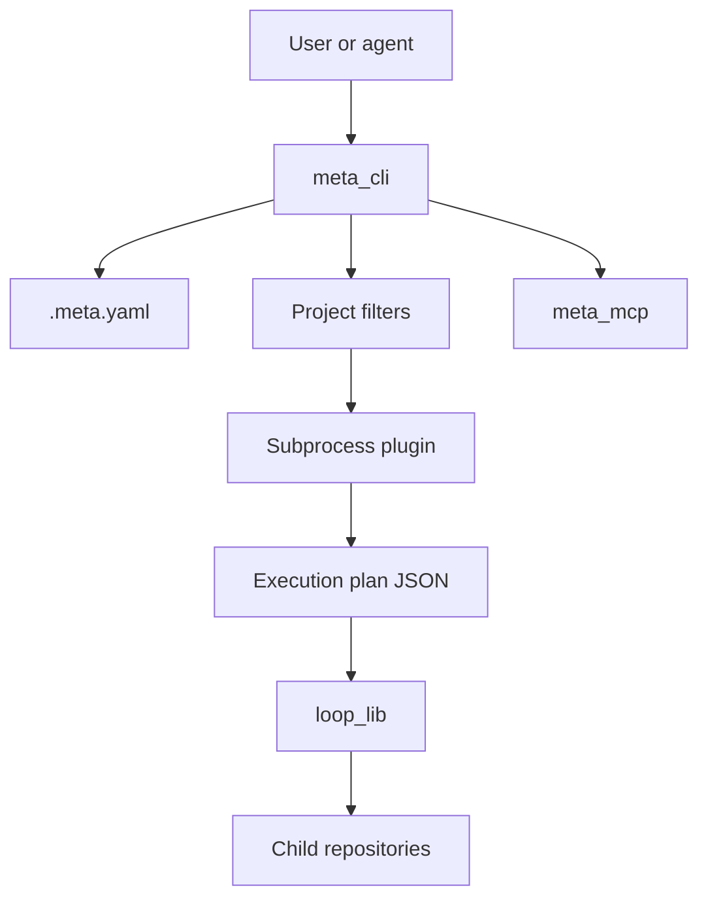

# Architecture

## Workspace Shape

```text
meta/
|-- .meta.yaml              # child repo inventory
|-- Cargo.toml              # Rust workspace boundary
|-- loop_cli/               # child repo, loop command binary
|-- loop_lib/               # child repo, loop execution library
|-- meta_cli/               # child repo, main meta binary
|-- meta_core/              # child repo, shared meta core
|-- meta_git_cli/           # child repo, git plugin binary
|-- meta_git_lib/           # child repo, shared git logic
|-- meta_mcp/               # child repo, MCP server
|-- meta_plugin_protocol/   # child repo, plugin protocol types
|-- meta_project_cli/       # child repo, project plugin
`-- meta_rust_cli/          # child repo, Rust/Cargo plugin
```

All listed child directories are expected to be independent Git repositories.
The root `.gitignore` ignores them so their contents do not become root-repo
tracked files.

## Data Flow



## Integration Points

- `.meta.yaml`: project names, remotes, capabilities, and dependency metadata.
- `Cargo.toml`: clean-room Rust workspace member list.
- `install.sh` and `install.ps1`: release install entrypoints.
- `distribution/homebrew/`: Homebrew packaging template.
- `docs/mcp_server.md` and `docs/plugin_development.md`: external protocol and
  agent integration references.
- `.kb/store/`: durable GitKB documents that should be tracked as text.
- `.kb/workspaces/` and `.kb/.cache/`: local GitKB edit/cache surfaces that
  should remain ignored.
