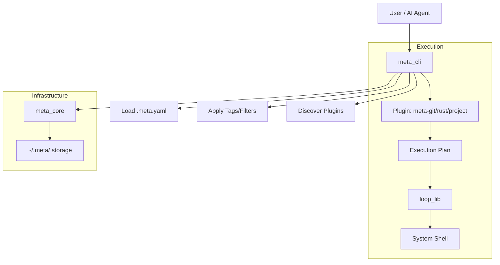

## System Structure
Meta is a Rust workspace consisting of 10 crates, each with a specific responsibility.

### Core Components
- **meta_cli**: The main entry point. Handles configuration, filtering, plugin discovery, and command routing.
- **loop_lib**: The foundational execution engine. Handles directory expansion, parallel/serial command execution, and output aggregation.
- **meta_core**: Shared infrastructure for data directory management (`~/.meta/`), file-based locking, and atomic JSON storage.
- **meta_plugin_protocol**: Standardized types for host-to-plugin communication.

### Specialized Plugins (Planners)
- **meta_git_cli**: Handles recursive cloning, status, and workspace snapshots.
- **meta_rust_cli**: Handles Cargo-specific operations across repositories.
- **meta_project_cli**: Handles project health and configuration synchronization.

### Integration Layer
- **meta_mcp**: A Model Context Protocol server that exposes meta's tools to AI agents.

## Workspace Architecture
This is a **meta-repo**, not a monorepo. It manages dozens of independent git repositories. To support Rust development, it uses a **Hybrid Workspace** model:

1. **Integrated Members**: Small, single-package repositories (e.g., `rtk`, `teri`) are added to the root `Cargo.toml` as workspace members. This provides a unified view for the IDE and simple `cargo build` workflows.
2. **Excluded Workspaces**: Large repositories that are themselves Cargo workspaces (e.g., `RuVector`, `icm`) are **excluded** from the root `Cargo.toml`. They are managed exclusively through `meta` commands and the `Makefile` to avoid version conflicts.
3. **Common Tooling**: Every repository in the workspace is governed by the same `Makefile` and `meta` configuration, providing a consistent interface for building, testing, and deployment regardless of internal implementation.

## Orchestration Flow
Meta uses a multi-stage process to orchestrate tasks across the infrastructure:

1. **Topological Sort**: Using the `provides` and `depends_on` fields in `.meta.yaml`, `meta_cli` builds a directed acyclic graph (DAG). It performs a topological sort to ensure that dependencies are processed before dependents.
2. **Planning**: The CLI passes the ordered list of projects to the relevant plugin (e.g., `meta-git`). The plugin returns an `ExecutionPlan` (JSON) containing the specific shell commands for each project.
3. **Execution (`loop_lib`)**:
    - **Staggered Spawning**: To avoid overwhelming SSH sockets or rate limits, the engine introduces a configurable delay between process spawns.
    - **Parallelism**: Uses `Rayon` for high-performance execution across available CPU cores.
    - **Output Management**: Captures and aggregates stdout/stderr in real-time, replaying them in a non-interleaved format to maintain readability across dozens of repos.

## Data Flow

